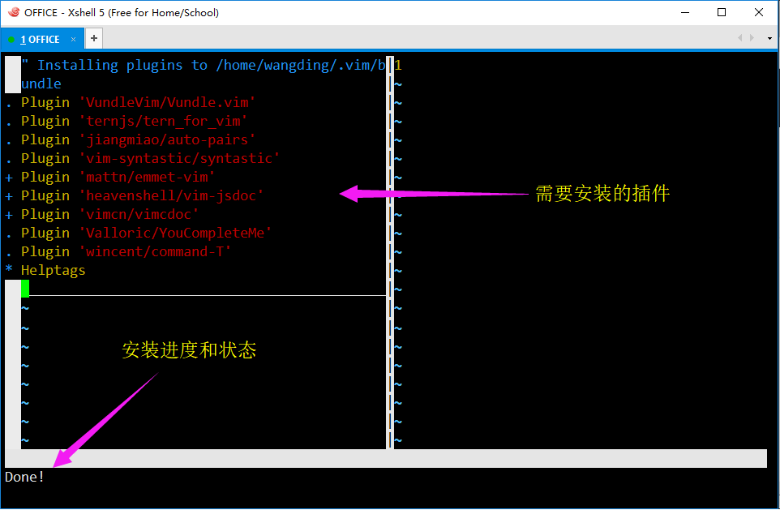

# 搭建 Node.js 开发环境

本文档基于 Linux CentOS 7 发行版，搭建基于命令行的 Node.js 开发环境。下面的安装步骤，如果没有特殊说明，**一定不要在 root 账户下操作**。

## 下载软件包

在 Win10 操作系统下载下列软件包：

- 从腾讯软件中心下载 VMWare Worksation Pro 最新版  
- 从腾讯软件中心下载 XShell 最新版  
- 从 CentOS 官网下载 [CentOS 安装镜像包](http://isoredirect.centos.org/centos/7/isos/x86_64/CentOS-7-x86_64-Everything-1708.iso)

## 安装软件包

在 Win10 操作系统安装下列软件包：

- 安装 VMWare Workstation
- 安装 XShell

## 安装 Linux 虚拟机

### 创建空白虚拟机

运行 vmware workstation pro 软件，创建一个空白虚拟机，操作如下：

- vmware 软件窗口中点击“创建新的虚拟机”按钮
- 出现新建虚拟机向导对话框
- 您希望选择什么类型的配置，选择“自定义（高级）”，点击“下一步”按钮
- 虚拟机硬件兼容性配置，使用默认设置，点击“下一步”按钮
- 安装来源，选择“稍后安装操作系统”来创建一个空白的虚拟机，点击“下一步”按钮
- 客户端操作系统，选择“Linux”，版本，选择“CentOS 64位”，点击“下一步”按钮
- 虚拟机名称和位置，使用默认设置或者自己定义，点击“下一步”按钮
- 处理器配置，使用默认设置：1 个 CPU 1 个内核，点击“下一步”按钮
- 内存配置，使用默认设置：1024 M（1G 内存），点击“下一步”按钮
- 网络连接配置，使用默认设置：使用网络地址转换（NAT），点击“下一步”按钮
- I/O 控制器类型，使用默认设置：LSI Logic（推荐），点击“下一步”按钮
- 选择磁盘，使用默认设置：创建新虚拟磁盘，点击“下一步”按钮
- 指定磁盘容量，使用默认设置：20 G，并选择“将虚拟磁盘存储为单个文件”，点击“下一步”按钮
- 磁盘文件名称：使用默认设置，点击“下一步”按钮
- 已经准备好虚拟机，点击“完成”按钮

### 设置虚拟机硬件

在刚创建的空白虚拟机上，需要进一步编辑虚拟机设置，操作如下：

- 移除声卡硬件
- 移除 USB 控制器硬件
- 移除打印机硬件
- CD/DVD 使用 ISO 镜像文件：点击“浏览”按钮，找到下载的 CentOS ISO 镜像文件
- 指定显示器设置，配置监视器器的分辨率为：1024 X 768
- 最后，点击“确定”按钮，完成虚拟机硬件设置

### 安装操作系统

点击“开启虚拟机”绿色三角按钮，虚拟机窗口出现电脑自检画面，安装向导界面中，进行如下操作设置：

【有待完善】

- 第一个安装画面：选择安装 CentOS 7
- 语言：中文
- 安全策略：Common Profile for General-Purpose Systems
- 软件选择：
- 安装介质
- 安装位置
- 网络启用
- root 密码
- 创建新用户并设置密码，把新用户加到管理员组中

### 设置虚拟机 IP 地址

【有待完善】

### 通过 XShell 连接 Linux 虚拟机

【有待完善】

**此后的所有安装步骤都是在 Linux 虚拟机中进行操作。**

## 安装 vim 8

```bash
# 安装工具软件和依赖库
sudo yum install -y ruby ruby-devel lua lua-devel luajit wget unzip \
luajit-devel ctags git python python-devel \
python3 python3-devel tcl-devel ncurses-devel\
perl perl-devel perl-ExtUtils-ParseXS \
perl-ExtUtils-XSpp perl-ExtUtils-CBuilder \
perl-ExtUtils-Embed gcc lrzsz ncurses-devel

# 切换到家目录
cd

# 创建 GitHub 仓库根目录
mkdir repos
cd repos

# 下载 vim 源代码
wget https://github.com/vim/vim/archive/master.zip

# 解压缩源代码
unzip master.zip

# 切换到 vim 源代码目录
cd vim-master/src

# 配置 vim
./configure --with-features=huge \
--enable-multibyte \
--enable-rubyinterp=yes \
--enable-pythoninterp=yes \
--with-python-config-dir=/usr/lib/python2.7/config \
--enable-perlinterp=yes \
--enable-luainterp=yes \
--enable-gui=gtk2 \
--enable-cscope \
--prefix=/usr/local

# 编译软件
make

# 安装软件
sudo make install

# 检查 vim 版本，应该是 8
vim --version
```

上面是源代码编译安装，或者使用 `yum` 安装

```
# 切换到 root 账户下
su

rpm -Uvh http://mirror.ghettoforge.org/distributions/gf/gf-release-latest.gf.el7.noarch.rpm
rpm --import http://mirror.ghettoforge.org/distributions/gf/RPM-GPG-KEY-gf.el7
yum -y remove vim-minimal vim-common vim-enhanced sudo
yum -y --enablerepo=gf-plus install vim-enhanced sudo

# 切换到 wangding 账户
exit

# 检查 vim 版本，应该是 8
vim --version
```

## 安装 node.js

```bash
sudo yum install -y gcc-c++ make
curl --location https://rpm.nodesource.com/setup_10.x | sudo bash -
sudo yum install -y nodejs

# 检查 node.js 安装是否成功
node -v

# 检查 npm 是否安装成功
npm -v
```

## 安装 zsh

zsh 的安装过程如下：

```bash
# 查看当前的 shell
echo $SHELL

# 安装 zsh
sudo yum install -y zsh

# 安装 wget
sudo yum install -y wget

# 安装 oh-my-zsh
wget https://github.com/robbyrussell/oh-my-zsh/raw/master/tools/install.sh -O - | sh

# 却换 bash 至 zsh
chsh -s /bin/zsh

# 查新登录 shell
exit

# 连接 XShell，重新登录 Linux 检查命令行提示符变化
```

## 安装 vim 和 zsh 配置文件

安装完 vim 和 zsh 配置文件后，需要安装 zsh 插件。特别注意，**安装 zsh 插件的过程不要中途退出，一定要等到出现命令行提示符再进行其他操作。**

```bash
# 切换到 repos 目录
cd ~/repos

# 克隆 wangding/tools 仓库
git clone https://github.com/wangding/tools

# 安装配置文件
cd tools
./install.sh

# 检查配置文件
ls -al ~

# .vimrc 文件应该存在
# .zshrc 文件应该存在

# 安装 zsh 插件，注意安装过程不要中途退出，一定要等到出现命令行提示符再进行其他操作
zsh

# 退出当前 Shell
exit

# 连接 XShell，重新登录 Linux，zsh 的主题和插件都应该安装成功
```

## 安装 vim 插件管理工具 Vundle

```bash
mkdir -p ~/.vim/bundle
cd ~/.vim/bundle
git clone https://github.com/VundleVim/Vundle.vim.git
```

## 安装 vim 插件

注意：安装 vim 插件的过程，**不要中途退出，一定要等到所有插件都安装完成后，再进行其他操作**。安装插件的过程如下图所示。

```bash
# 运行 vim 编辑器
vim

# 安装 vim 插件
:PluginInstall

# 退出 vim 插件安装
:q

# 退出 vim
:q
```


## 安装 tern_for_vim 的第三方依赖

```bash
# 切换到 tern_for_vim 目录
cd ~/.vim/bundle/tern_for_vim

# 安装第三方依赖
npm Install
```

## 安装 YCM

```bash
# 安装开发工具
sudo yum install -y automake gcc gcc-c++ kernel-devel cmake python-devel python3-devel

# 切换到 YCM 目录
cd ~/.vim/bundle/YouCompleteMe

# 安装 YCM
./install.py --tern-completer
```

## 安装开发辅助工具

```bash
su                    // 切换到 root 账户
yum install -y tree python-pygments     // 安装 Linux 命令行 tree 工具和语法高亮工具
npm i -g htmlhint     // 安装 HTMLHint 静态代码检查工具
npm i -g csslint      // 安装 CSSLint 静态代码检查工具
npm i -g eslint       // 安装 ESLint 静态代码检查工具
npm i -g browser-sync // 安装热加载工具
su wangding           // 切换到开发者账户
```

## 检查开发辅助工具

```bash
tree /boot              // 应该看到 boot 目录的树状结构
htmlhint --version      // 应该看到版本号：0.9.13 或以上
csslint --version       // 应该看到版本号：v1.0.4 或以上
eslint --version        // 应该看到版本号：v4.17.0 或以上
browser-sync --version  // 应该看到版本号：2.23.6 或以上
```

## 检查 vim 插件

- 验证 JavaScript 代码补全插件，操作步骤如下：

```bash
cd
mkdir test
cd test
touch .tern-project
vim .tern-project
```

.tern-project 文件的内容如下：

```javascript
{
  "libs": ["browser", "jquery"],
  "plugins": {
    "node": {}
  }
}
```

```bash
vim a.js

i                    // 进入 vim 的插入模式
window.              // 输入 window 然后按 . 看一下是否有 window 对象的属性、方法列出
Tab                  // 按键盘 tab 键，在 window 对象的属性、方法上切换
(                    // 切换到 Date 按左括号 (，移动光标到行尾，输入分号 ;
Enter X 2            // 按两次回车键
$.                   // 输入 $ 然后按 . 看一下是否有 JQuery $ 对象的属性、方法列出
                     // 如果没有自动补全的列表，删除 . 重新输入 . 再一两次
                     // 切换到 isArray 按左括号 (，移动光标到行尾，输入分号 ;
Enter X 2            // 按两次回车键
process.             // 输入 process 然后按 . 看一下是否有 process 对象的属性、方法列出
                     // 输入 ar，tab 键选择 argv，输入分号 ;
:q!                  // 不保存退出
```

- 验证 emmet vim 插件，操作步骤如下：

```bash
vim  a.html          // 命令行打开 vim 编辑器
i                    // 进入插入模式
!<ctrl>+y,           // 输入感叹号，然后同时按 ctrl 和 y 键，然后按逗号键
                     // vim 窗口中应该出现 HTML5 的页面框架代码
:q!                  // 不保存退出
```

- 验证 jsdoc vim 插件，操作步骤如下：

```bash
vim  a.js            // 命令行打开 vim 编辑器
i                    // 进入插入模式
                     // 写一个 x + y 的 add 加法函数，代码如下
function add(x, y) {
  return x + y;
}
ESC                  // 退出插入模式，进入普通模式，移动光标到第一行
:JsDoc               // 按冒号进入命令模式，输入 JsDoc<回车>，注意命令大小写不要写错
                     // vim 窗口中应该出现函数头注释框架
:q!                  // 不保存退出
```

- 验证 CSS 代码补全功能，操作步骤如下：

```bash
vim  a.css           // 命令行打开 vim 编辑器
i                    // 进入插入模式
                     // 写一个 body 的 CSS 样式代码，如下：
body {
  background:        // 注意在输入冒号和空格之后，应该弹出代码补全窗口
ESC                  // 回到普通模式
:q!                  // 不保存退出
```
