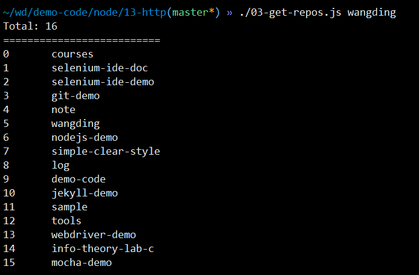

# 第八课：网络：分布式应用基础

## 任务 1：

要求：  
- 阅读 [net API 资料](http://nodejs.cn/api/net.html)  
- 阅读 [net 资料](http://javascript.ruanyifeng.com/nodejs/net.html)  

## 任务 1：

- 创建 11-tcp 目录
- 编写 01-server.js 脚本  

## 任务 2：

- 编写 02-my-telnet.js 脚本  
- 阅读 [dgram API 资料](http://nodejs.cn/api/dgram.html)  

## 任务 3：

- 创建 12-udp 目录  
- 编写 01-server.js 脚本  

## 任务 4：

- 编写 02-my-nc.js 脚本  
- 阅读 [http API 资料](http://nodejs.cn/api/http.html)  
- 阅读 [http 资料](http://javascript.ruanyifeng.com/nodejs/http.html)  

## 任务 5：

- 创建 13-http 目录  
- 编写 01-server.js 脚本  

## 任务 6：

- 编写 02-my-crul.js 脚本  

## 任务 7：

- 编写 03-get-weather.js 脚本，实现以下功能：  
  - 调用天气预报 API，实现城市天气查询：https://www.jisuapi.com/api/weather/  
  - 用 GET 方法请求天气信息  

## 任务 8：

- 编写 03-get-repos.js 脚本，实现以下功能：  
  - 获取某个账户的所有 GitHub 仓库的数量和名称  
  - API 地址：`https://api.github.com/search/repositories?q=user:wangding`  
  - API 参考：https://developer.github.com/v3/
  - 运行效果如下图所示：  
  -   

## 任务 9：

- 编写 04-post.js 脚本  
- 编写 04-post-weather.js 脚本，实现以下功能：
  - 调用天气预报 API，实现城市天气查询：https://www.jisuapi.com/api/weather/  
  - 用 POST 方法请求天气信息  
- 阅读 [dns API 资料](http://nodejs.cn/api/net.html)  

## 任务 10：

- 创建 14-dns 目录
- 编写 01-dns.js 脚本  

