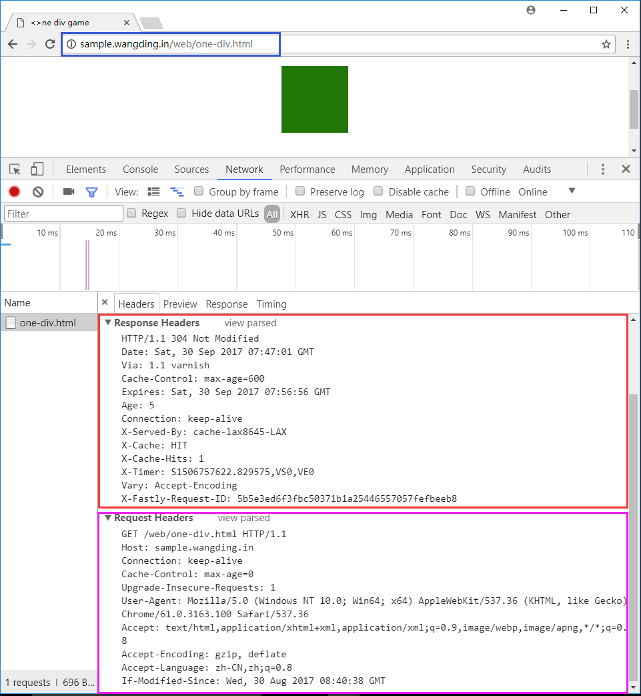

# 第十课：HTTP 网络编程

## 任务 1：阅读 Node.js API 资料

- [http API 资料](http://nodejs.cn/api/http.html)  

## 任务 2：了解 HTTP 协议

- HTTP 协议相关的知识主要包括：
  - HTTP 命令，包括：GET、POST，等
  - HTTP 报文，包括：请求报文头，请求报文体、响应报文头和响应报文体
  - HTTP 响应状态码
- 阅读 [HTTP 协议资料](https://en.wikipedia.org/wiki/Hypertext_Transfer_Protocol#Message_format)  
- 阅读 [HTTP 协议入门](http://www.ruanyifeng.com/blog/2016/08/http.html)  
- 阅读 [HTTP 头部字段资料](https://en.wikipedia.org/wiki/List_of_HTTP_header_fields)  
- 阅读 [HTTP 状态码资料](https://en.wikipedia.org/wiki/List_of_HTTP_header_fields)  
- 用 telnet 工具了解 HTTP 协议的相关知识
- 用 curl 工具了解 HTTP 协议的相关知识
- 用 chrome 开发者工具了解 HTTP 协议的相关知识
- 用上面三个工具访问 [one-div.html](http://sample.wangding.in/web/one-div.html)，查看请求和响应的头信息，如下图所示：  
- 搞明白请求头部字段列表中每个字段的含义和作用  
- 搞明白响应头部字段列表中每个字段的含义和作用  
-   

## 任务 3：实现 HTTP 客户端

要求：
- 创建 16-http 目录
- 编写 01-my-curl.js 脚本  
- 可以解释命令行参数，命令行参数是要请求的 URL 地址
- 向指定的 URL 地址发出 GET 请求
- 将 HTTP 响应的报文头和报文体内容打印到控制台
- 用 http 模块的 get 方法
- 定义 user-agent 为 01-my-curl

## 任务 4：对 HTTP 接口发出 GET 请求

要求：
- 编写 02-get-weather.js 脚本
- 调用天气预报 API，实现城市天气查询：https://www.jisuapi.com/api/weather/  
- 用 GET 方法请求天气信息  
- 编写 02-get-repos.js 脚本
- 获取某个账户的所有 GitHub 仓库的数量和名称  
- API 地址：`https://api.github.com/search/repositories?q=user:wangding`  
- API 参考：https://developer.github.com/v3/
- 运行效果如下图所示：  
-   

## 任务 5：发起 POST 请求

- 编写 03-my-curl.js 脚本  
- 可以解释命令行参数，命令行参数可以定义请求类型是：GET、POST 或其他
- 向指定的 URL 地址发出特定请求
- 将 HTTP 响应的报文头和报文体内容打印到控制台
- 用 http 模块的 post 方法
- 定义 user-agent 为 03-my-url

## 任务 6：对 HTTP 接口发出 POST 请求

- 编写 04-post-weather.js 脚本
- 调用天气预报 API，实现城市天气查询：https://www.jisuapi.com/api/weather/  
- 用 POST 方法请求天气信息  

## 任务 7：编写爬虫程序

要求：  
- 编写 05-crawler.js 脚本
- 爬取 51CTO 学院所有的免费课程信息
- URL：http://edu.51cto.com/courselist/index-zh5.html
- 将爬取的课程信息格式化输出到控制台

## 任务 8：处理 HTTP 重定向

要求：
- 编写 06-redirection.js 脚本
- 实现对 HTTP 协议的重定向状态的处理
- 测试 URL：http://www.sian.com/
- 需要获取重定向后的最终页面
- 将最终页面输出到控制台

## 任务 9：实现 HTTP 代理

要求：
- 编写 07-proxy.js 脚本
- 实现对 HTTP 协议的 GET 请求的代理
- 在代理程序中捕获浏览器的 HTTP 请求信息，输出到控制台
- 将 HTTP 响应信息输出到控制台
- 配置 chrome 浏览器的代理设置
- 测试代理程序

## 任务 10：实现 HTTP 基本验证

要求：
- 编写 08-auth-basic.js 脚本
- 实现 web 服务程序
- 当浏览器对根路由（/）发出 HTTP 请求时，脚本不需要身份验证，发送给客户端非敏感信息
- 当浏览器对后台管理路由（admin）发出 HTTP 请求时，脚本需要身份验证
- 身份验证基于 HTTP 协议的基本验证
- 当收到用户名和密码信息之后，验证身份信息
- 如果身份信息正确，发送给客户端敏感信息
- 如果身份信息不合法，则继续提示用户输入身份信息

## 任务 11：阅读 Node.js API 资料

要求：
- [https API 资料](http://nodejs.cn/api/https.html)

## 任务 12：实现 HTTPS 服务

要求：
- 编写 09-https-server.js 脚本
- 实现 HTTPS 协议的 Web 服务
- 收到浏览器请求后，发送给客户端 hello world 信息
